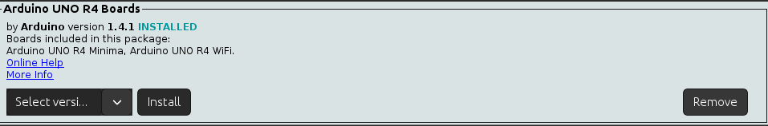
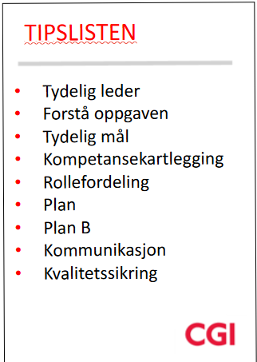

# Kodekveld Embedded Edition

Velkommen til Kodekveld! Dette repositoriet inneholder all informasjon og ressurser du trenger for å forberede deg til og delta i arrangementet.

## 🚀 Oversikt

- **Lag:** Grupper på opptil 5 deltakere
- **Utstyr:** Hvert lag mottar en Arduino Uno R4 Minima og 100 enheter virtuell valuta
- **Utfordring:** Bygg det kuleste mulige prosjektet på 2 timer ved hjelp av innkjøpte moduler og sensorer
- **Vinner:** Laget med det mest imponerende prosjektet vinner en premie! Husk at det er mulig å imponere med lagarbeid, ånd, kreativitet, estimering og mange andre måter!

## 📋 Viktige Dokumenter

- [Regler og Retningslinjer](./RULES.md) - Detaljert informasjon om kodekveld-reglene
- [Tilgjengelige Moduler](./MODULES.md) - Liste over moduler og sensorer som er tilgjengelige for kjøp med kostnader
- [Ressurser og Datasheets](./RESOURCES.md) - Nyttige ressurser, datablader og inspirasjon
- [Eksempelprosjekter](./EXAMPLES.md/) - Enkle eksempelprosjekter for å komme i gang

## 🔧 Forberedelser

Vennligst fullfør følgende oppsett **før** kodekvelden for å sikre at du kan begynne umiddelbart når arrangementet starter.

### Installere Arduino IDE

1. **Last ned Arduino IDE**

   - Gå til [den offisielle Arduino-nettsiden](https://www.arduino.cc/en/software)
   - Last ned versjonen for ditt operativsystem (Windows, macOS eller Linux)
   - Følg installasjonsinstruksjonene for ditt OS

2. **Start Arduino IDE**
   - Åpne Arduino IDE etter installasjon
   - Du skal se en tom sketch med funksjonene `void setup()` og `void loop()`

### Sette opp Arduino Uno R4

For å bruke Arduino Uno R4 Minima, som er mikrokontrolleren vi skal bruke under kodekvelden, må du legge den til i Arduino IDE, tenk på det som en extension i VSCode.

1. **Installer Arduino Uno Rev4 støtte**
   - I Arduino IDE, gå til **Tools → Board → Boards Manager**
   - Søk etter "Arduino Uno R4"
   - Installer den nyeste versjonen av Arduino UNO R4 Boards-pakken
     
2. **Velg kortet**

   - Gå til **Tools → Board → Arduino Renesas UNO R4 Boards**
   - Velg **Arduino Uno R4 Minima**

3. **Test oppsettet ditt (Valgfritt)**
   - Koble Arduino Uno R4 til datamaskinen ved hjelp av en USB-kabel
   - Gå til **Tools → Port** og velg porten hvor Arduino er tilkoblet
   - Åpne Blink-eksempelet: **File → Examples → 01.Basics → Blink**
   - Klikk på Upload-knappen (høyrepil) øverst til venstre
   - Hvis den innebygde LED-en på Arduino begynner å blinke, fungerer oppsettet ditt riktig!

#### Extra setup

1. **Installer Git**

   - Last ned og installer Git fra [git-scm.com](https://git-scm.com/)
   - Dette vil være nyttig for å klone dette repositoriet og ta bruk av eksempelkode

2. **Klon dette repositoriet**
   - Åpne en terminal eller kommandolinje
   - Kjør: `git clone [repository-url]`
   - Naviger til repositoriet: `cd [repository-name]`

## 🛠️ Tips for Suksess

1. **Planlegg før bygging**

   - Sett av tid i begynnelsen på å forstå oppgaven, planlegge prosjektet nøye og bestemme hvilke moduler man skal kjøpe
   - Skisser et grunnleggende kretsdiagram før du kobler noe
   - Sett opp et budsjett ark, der man holder styr på hvor mye penger man bruker og hvor mye man eventuelt har igjen
   - Det tar tid å sette opp ledninger og moduler riktig, sett av tid til det
   - Husk at man kan handle flere ganger, så man kan sette opp iterasjoner av prosjektet

2. **Del og erobre**

   - Kartlegg gruppemedlemmenes egenskaper(Hvem er egnet til å gjøre hvilke roller)
   - Tildel forskjellige oppgaver til gruppemedlemmer (koding, kobling, testing, osv.)
   - Samarbeid effektivt for å maksimere tidsgrensen på to timer
   - Ha en tydelig leder

3. **Hold det enkelt**

   - Start med en enkel fungerende prototype, legg deretter til funksjoner hvis tiden tillater det
   - Et enkelt, godt utført prosjekt er bedre enn et komplekst, uferdig ett

4. **Test tidlig og ofte**

   - Test koden og kretsene trinnvis
   - Ikke vent til slutten med å teste hele prosjektet

5. **Ha det gøy!**

   - Til syvende og sist så er dette bare en harmløs konkurranse for å bli kjent, øve på å jobbe i gruppe og å lære seg noe nytt. Det er viktigere å ha det morro med oppgaven enn å vinne!

   **CGI Tipsliste for suksess**

   

## 📅 Timeplan for Kodekvelden

| Tid           | Aktivitet                                      |
| ------------- | ---------------------------------------------- |
| 17:00 - 17:45 | Ankommelse, mat og chill                       |
| 17:45 - 18:15 | Introduksjon og presentasjon                   |
| 18:15 - 18:30 | Lagene samles og finner plass                  |
| 18:30 - 20:30 | Kodekveld                                      |
| 20:30 - 20:50 | Lagene presenterer løsningene sine til dommere |
| 20:50 - 21:00 | Bedømming og premieseremoni                    |
| 21:00 - xx:xx | Mingling og hygge                              |

## 🙋 FAQ

**Spørsmål: Trenger jeg tidligere erfaring med Arduino?**  
Svar: Nei, nybegynnere er velkomne! Sjekk ut eksempelprosjektene i dette repositoriet for å komme i gang.

**Spørsmål: Kan jeg ta med eget utstyr?**  
Svar: Ja, men kun den utdelte Arduino Uno Rev4 og innkjøpte moduler kan brukes i prosjektet ditt for å delta i konkurransen.

**Spørsmål: Hvilke kriterier vil bli brukt til bedømming?**  
Svar: Prosjekter vil bli bedømt på kreativitet, teknisk vanskelighetsgrad, utførelse, lagarbeid, estimat og presentasjon. Se [Regler og Retningslinjer](./RULES.md) for mer informasjon.

**Spørsmål: Får jeg lov til å bruke AI til å hjelpe meg å kode?**
Svar: Absolutt! Laget har bare 2 timer til disposisjon, som er veldig lite tid for å lage et prosjekt. Det anbefales at du bruker alle mulige midler som kan hjelpe deg å lage et godt prosjekt innen tiden.

##Lykke til, og god koding!
